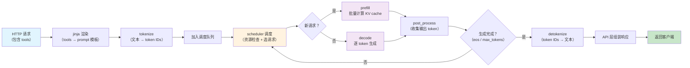

# Phase 0: vLLM 请求处理流程



## 各环节对应代码

| 环节 | 文件 |
|---|---|
| API 入口 | `vllm/entrypoints/openai/api_server.py` |
| 引擎主循环 | `vllm/v1/engine/core.py` |
| 调度器 | `vllm/v1/core/sched/scheduler.py` |
| 模型执行 | `vllm/v1/worker/gpu/model_runner.py` |

## 完整请求链路（Session 1 回顾）

```
请求进来
  → jinja 渲染（tools 格式化进 prompt）
  → tokenize（文本 → token IDs）
  → scheduler 调度
    → 新请求 → 分配尽量多的 token（prefill）
    → 已有请求 → 分配 1 个 token（decode）
  → model_runner 执行
    → 多个 token → prefill 路径（并行算 KV cache）
    → 1 个 token → decode 路径（复用 KV cache）
  → 返回结果
```

## 代码组织

```
请求入口
  vllm/entrypoints/openai/api_server.py

引擎主循环（每 step 调一次）
  vllm/v1/engine/core.py → step()
    │
调度器（决定每轮谁跑、跑多少 token）
  vllm/v1/core/sched/scheduler.py → schedule()
    │
模型执行器（实际调用模型 forward）
  vllm/v1/worker/gpu_model_runner.py → execute_model()
    │
Attention 后端（根据 query_len 隐式区分 prefill/decode）
  vllm/v1/attention/backends/flash_attn.py
```

## Prefill/Decode 的"隐式传递"

scheduler 到 model_runner 之间没有 `if is_prefill` 这样的标签。

区分是靠 `num_scheduled_tokens` 这个数字隐式传递的：

```
scheduler:  request_A → num_scheduled_tokens = 512（"这是 prefill"）
            request_B → num_scheduled_tokens = 1  （"这是 decode"）
                  ↓
model_runner: max_query_len = max(512, 1)
              _is_uniform_decode(max_query_len) → False
              → 不走 decode 优化路径
                  ↓
attention 后端: query_len = 512 → 调 prefill kernel
                query_len = 1   → 调 decode kernel
```
