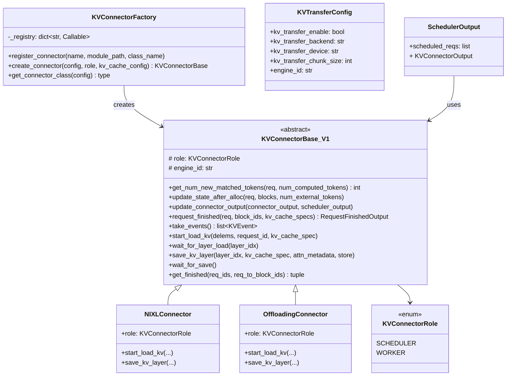
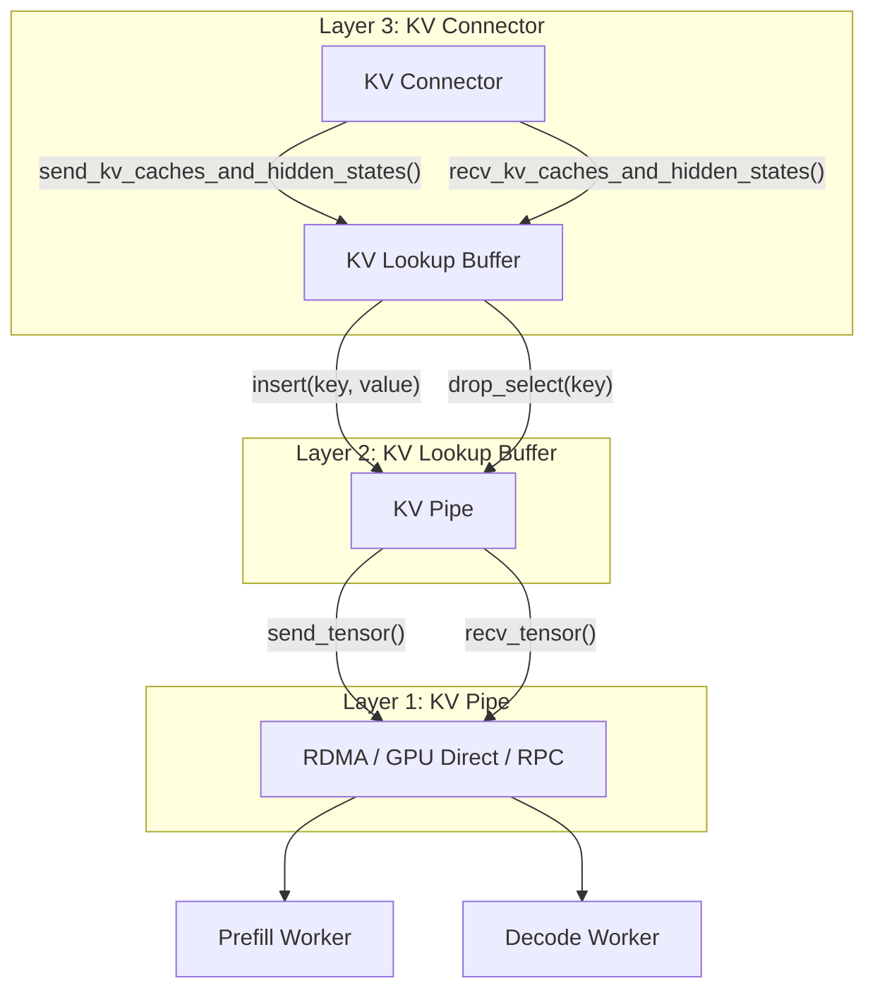
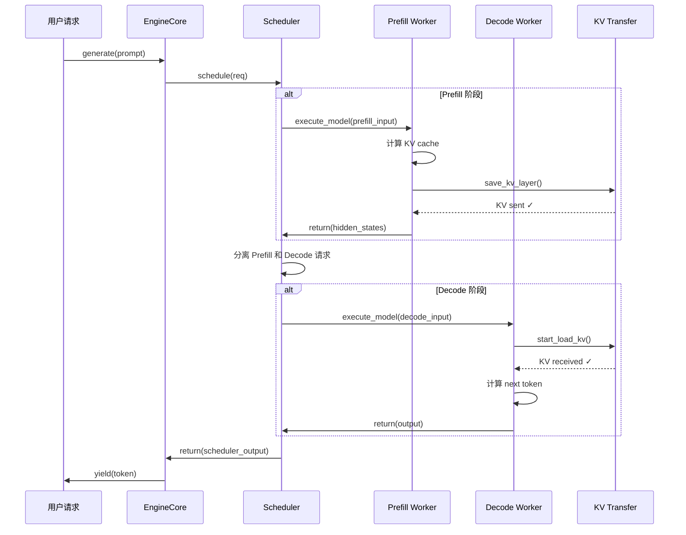
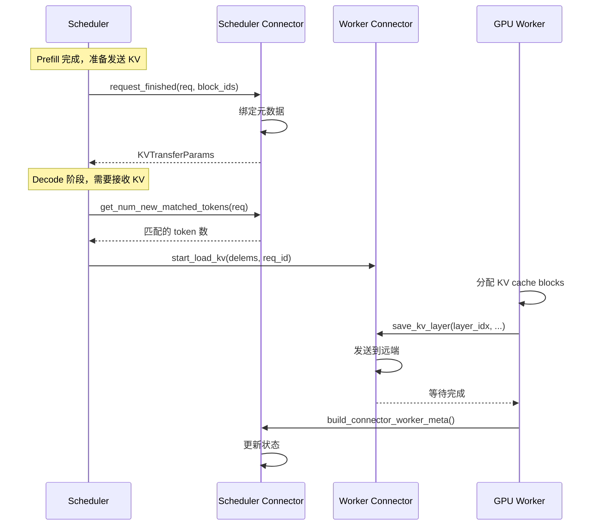
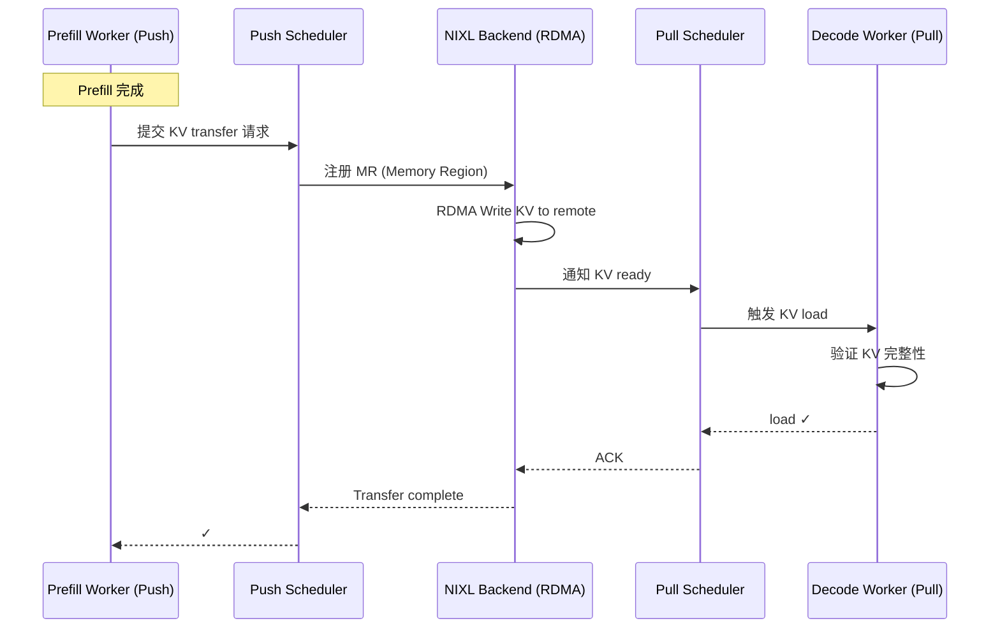
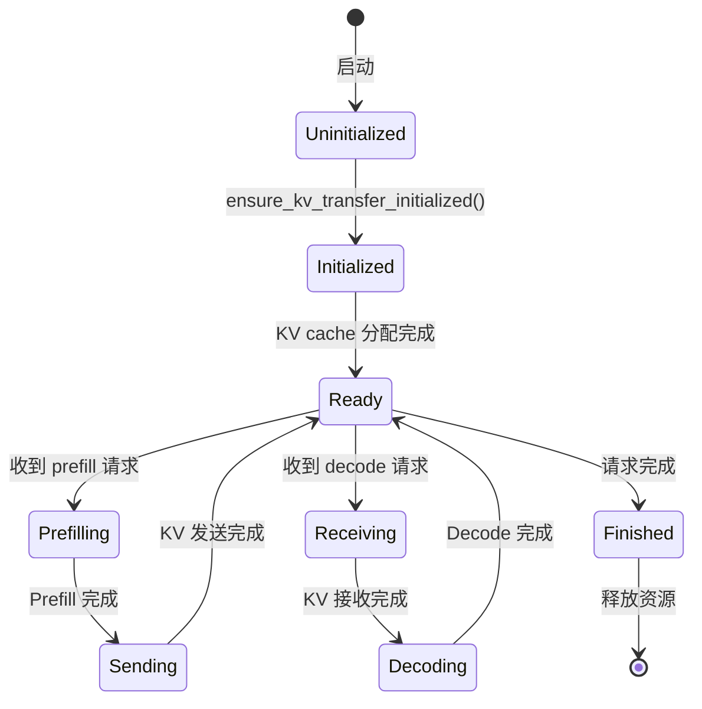

# PD 分离（Disaggregated Prefill-Decode）代码架构

> 代码版本：vllm v0.29.0 | 2026-08-12

## 核心概念

PD 分离将 LLM 推理的两个阶段拆分到独立的 Worker 上执行：
- **Prefill Worker**：处理输入 prompt，生成初始 KV cache
- **Decode Worker**：基于 KV cache 逐 token 生成输出

两个 Worker 通过 **KV Transfer** 机制交换 KV cache，实现解耦。

---

## 文件目录结构

```
vllm/distributed/kv_transfer/
├── __init__.py                          # 导出入口
├── README.md                            # 架构说明（含流程图）
├── kv_transfer_state.py                 # 全局状态管理 + 初始化
│
├── kv_connector/
│   ├── base.py                          # 基类定义（KVConnectorBase = KVConnectorBase_V1）
│   ├── factory.py                       # 工厂类：根据配置创建 connector
│   │
│   └── v1/
│       ├── __init__.py                  # 导出 KVConnectorBase_V1, KVConnectorRole
│       ├── base.py                      # 核心抽象基类（scheduler-side + worker-side 接口）
│       │
│       ├── nixl/                        # NIXL connector（RDMA 高性能）
│       │   ├── connector.py             # NIXLConnector 主类
│       │   ├── base_worker.py           # Worker 基类
│       │   ├── push_worker.py           # Prefill 侧（发送 KV）
│       │   ├── pull_worker.py           # Decode 侧（接收 KV）
│       │   ├── push_scheduler.py        # Prefill 侧调度器
│       │   ├── pull_scheduler.py        # Decode 侧调度器
│       │   ├── base_scheduler.py        # 调度器基类
│       │   ├── metadata.py              # 元数据定义
│       │   ├── tp_mapping.py            # TP 映射
│       │   ├── stats.py                 # 统计信息
│       │   └── utils.py                 # 工具函数
│       │
│       ├── offloading/                  # CPU offloading connector
│       │   ├── connector.py
│       │   ├── worker.py
│       │   ├── scheduler.py
│       │   ├── config.py
│       │   ├── events.py
│       │   ├── metrics.py
│       │   └── canonical_mapping.py
│       │
│       ├── mooncake/                    # Mooncake connector
│       │   └── store/worker.py
│       │
│       ├── moriio/                      # Moriio connector
│       │   ├── moriio_connector.py
│       │   ├── moriio_engine.py
│       │   └── moriio_common.py
│       │
│       ├── decode_bench_connector.py    # Benchmark connector
│       ├── example_hidden_states_connector.py  # 示例 connector
│       └── simple_cpu_offload_connector.py     # 简单 CPU offload

vllm/v1/worker/gpu_worker.py             # Worker 实现（调用 KV transfer）
vllm/v1/worker/gpu/kv_connector.py       # KVConnector（Worker-side 封装，pre_forward/post_forward）
vllm/v1/worker/gpu/ec_connector.py       # ECConnector（Encoder Cache connector，多模态）
vllm/v1/engine/core.py                   # EngineCore（初始化 KV transfer）
vllm/v1/core/sched/scheduler.py          # Scheduler（scheduler-side connector）
```

---

## 核心类图



---

## KV Transfer 三层抽象



**各层职责**：
1. **KV Pipe**：FIFO 管道，负责 tensor 传输（send/recv）
2. **KV Lookup Buffer**：解决 Prefill/Decode 执行顺序不一致问题（key=token, value=KV cache）
3. **KV Connector**：连接 vLLM 调度器和 Worker，管理元数据和生命周期

---

## 时序图：PD 分离完整流程



---

## 时序图：KV Connector 调度流程



---

## 时序图：NIXL Connector 详细流程



---

## KV Connector 生命周期



---

## 关键代码片段

### 1. KV Transfer 初始化（engine/core.py）

```python
# vllm/v1/engine/core.py
class EngineCore:
    def __init__(self, vllm_config, executor_class, ...):
        # 初始化 KV cache
        kv_cache_config = self._initialize_kv_caches(vllm_config)
        
        # 创建 Scheduler（包含 scheduler-side connector）
        self.scheduler = Scheduler(vllm_config, kv_cache_config, ...)
        
        # 初始化 Worker（包含 worker-side connector）
        self.model_executor = executor_class(vllm_config)
        
        # 如果有 KV connector，收集 handshake metadata
        kv_connector = self.scheduler.get_kv_connector()
        if kv_connector is not None:
            xfer_handshake_metadata = self.model_executor.get_kv_connector_handshake_metadata()
            kv_connector.set_handshake_metadata(xfer_handshake_metadata)
```

### 2. Worker KV Transfer 调用（gpu_worker.py）

```python
# vllm/v1/worker/gpu_worker.py
class Worker(WorkerBase):
    def initialize_from_config(self, kv_cache_config):
        # 初始化 KV cache
        self.model_runner.initialize_kv_cache(kv_cache_config)
        
        # 初始化 KV transfer connector
        if has_kv_transfer_group():
            ensure_kv_transfer_initialized(self.vllm_config, kv_cache_config)
    
    def get_kv_connector_handshake_metadata(self):
        if not has_kv_transfer_group():
            return None
        connector = get_kv_transfer_group()
        metadata = connector.get_handshake_metadata()
        pp_rank = get_pp_group().rank_in_group
        tp_rank = get_tp_group().rank_in_group
        return {(pp_rank, tp_rank): metadata}
```

### 3. KVConnector Worker-side 封装（gpu/kv_connector.py）

```python
# vllm/v1/worker/gpu/kv_connector.py
class KVConnector:
    """KVConnector interface used by GPUModelRunner."""
    
    def pre_forward(self, scheduler_output: "SchedulerOutput") -> None:
        """forward 前：绑定元数据，启动 KV load"""
        pass
    
    def post_forward(self, finished_req_ids, wait_for_save) -> KVConnectorOutput | None:
        """forward 后：等待 save 完成"""
        return None

class ActiveKVConnector(KVConnector):
    def __init__(self, vllm_config, kv_caches_dict):
        self.kv_connector = get_kv_transfer_group()
        # 注册 KV cache 到 connector
        self.kv_connector.register_kv_caches(kv_caches_dict)
        self.kv_connector.set_host_xfer_buffer_ops(copy_kv_blocks)
    
    def pre_forward(self, scheduler_output):
        # 处理抢占
        self.kv_connector.handle_preemptions(scheduler_output.kv_connector_metadata)
        # 绑定元数据
        self.kv_connector.bind_connector_metadata(scheduler_output.kv_connector_metadata)
        
        if scheduler_output.has_sync_kv_loads:
            self._start_load_kv()  # 同步加载
        else:
            self._pending_load_start = True  # 异步加载（在 post_forward 中启动）
```

### 4. KV Connector 基类接口（v1/base.py）

```python
# vllm/distributed/kv_transfer/kv_connector/v1/base.py
class KVConnectorBase_V1(ABC):
    """Scheduler-side + Worker-side 双角色接口"""
    
    # === Scheduler-side ===
    @abstractmethod
    def get_num_new_matched_tokens(self, req, num_computed_tokens) -> int:
        """获取远程 KV cache 中匹配的 token 数"""
        pass
    
    @abstractmethod
    def request_finished(self, req, block_ids, kv_cache_specs) -> RequestFinishedOutput:
        """请求完成时，绑定 KV transfer 元数据"""
        pass
    
    # === Worker-side ===
    @abstractmethod
    def start_load_kv(self, delems, request_id, kv_cache_spec):
        """开始加载 KV cache（可能异步）"""
        pass
    
    @abstractmethod
    def save_kv_layer(self, layer_idx, kv_cache_spec, attn_metadata, store):
        """保存第 i 层的 KV cache"""
        pass
```

---

## Connector 实现对比

| Connector | 传输方式 | 适用场景 | 性能特点 |
|-----------|----------|----------|----------|
| **NIXL** | RDMA / GPU Direct | 跨节点高性能 | 最低延迟，最高带宽 |
| **Mooncake** | RPC / 共享内存 | 单节点多 GPU | 中等性能 |
| **Offloading** | CPU ↔ GPU | 内存受限场景 | 带宽受限，成本低 |
| **Moriio** | 自定义 | 特殊硬件 | 可定制 |
| **DecodeBench** | Benchmark | 性能测试 | 无实际传输 |

---

## 配置示例

```python
from vllm.config import KVTransferConfig

# 启用 PD 分离
kv_transfer_config = KVTransferConfig(
    kv_transfer_enable=True,
    kv_transfer_backend="nixl",      # 使用 NIXL connector
    kv_transfer_device="cuda",
    kv_transfer_chunk_size=8192,
    engine_id="engine-0",
)
```

---

## 学习路径

### Phase 1: 架构理解
1. 读 `vllm/distributed/kv_transfer/README.md` — 整体架构
2. 读 `kv_transfer_state.py` — 全局状态管理
3. 读 `kv_connector/v1/base.py` — 核心接口定义

### Phase 2: 实现细节
4. 读 `kv_connector/factory.py` — connector 创建逻辑
5. 读 `nixl/connector.py` — NIXL 实现（最常用）
6. 读 `gpu_worker.py` — Worker 如何调用 KV transfer
7. 读 `gpu/kv_connector.py` — Worker-side KVConnector 封装（pre_forward/post_forward）

### Phase 3: 调度流程
8. 读 `engine/core.py` — EngineCore 初始化
9. 读 `core/sched/scheduler.py` — Scheduler 如何分离 prefill/decode
10. 读 `v1/engine/utils.py` — CoreEngine 管理

### Phase 4: 优化
11. 读 `nixl/push_worker.py` + `pull_worker.py` — 异步传输优化
12. 读 `offloading/config.py` — Offloading 策略
13. 对比不同 connector 的性能特点

---

## 常见问题

### Q: PD 分离和 TP/PP 的关系？
A: PD 分离是在 TP/PP 基础上的进一步拆分。每个 Prefill Worker 和 Decode Worker 内部都可以使用 TP/PP。

### Q: KV Transfer 的开销有多大？
A: 取决于 connector 实现：
- NIXL (RDMA): ~1-2μs per token
- Mooncake (RPC): ~10-50μs per token
- Offloading (CPU): ~100-500μs per token

### Q: 如何选择 connector？
A: 
- 跨节点高性能 → NIXL
- 单节点多 GPU → Mooncake
- 内存受限 → Offloading
- 测试/研究 → DecodeBench

### Q: EC Connector 是什么？
A: EC (Encoder Cache) Connector 用于多模态模型，负责在 Prefill/Decode 之间传输 encoder 输出（如图像特征）。实现类似 KV Connector，但传输的是 encoder cache 而非 KV cache。

---

## 参考资源

- 官方文档: `vllm/distributed/kv_transfer/README.md`（含架构流程图）
- 示例代码: `vllm/examples/disaggregated/`
- NIXL 项目: https://github.com/ai-dynamo/nixl
- 论文: Disaggregated Serving of Large Language Models
- 相关文件: `vllm/v1/worker/gpu/kv_connector.py`（Worker-side 封装）
- 相关文件: `vllm/v1/worker/gpu/ec_connector.py`（Encoder Cache connector）

---

*最后更新: 2026-08-12 (补充 kv_connector.py, ec_connector.py)*
