# vLLM 软件设计与实现文档

> 版本：v0.29.0 | 文档日期：2026-08-12

---

## 目录

1. [项目概述](#1-项目概述)
2. [需求分析](#2-需求分析)
3. [系统架构设计](#3-系统架构设计)
4. [用例设计](#4-用例设计)
5. [类图设计](#5-类图设计)
6. [时序图设计](#6-时序图设计)
7. [活动图设计](#7-活动图设计)
8. [模块设计](#8-模块设计)
9. [接口设计](#9-接口设计)
10. [数据流设计](#10-数据流设计)
11. [部署架构](#11-部署架构)
12. [配置管理](#12-配置管理)
13. [错误处理](#13-错误处理)
14. [性能优化](#14-性能优化)
15. [测试策略](#15-测试策略)
16. [附录](#16-附录)

---

## 1. 项目概述

### 1.1 项目背景

vLLM 是一个快速、易用的 LLM 推理和服务库，最初由 UC Berkeley Sky Computing Lab 开发，现已成为最活跃的开源 AI 项目之一，拥有 2000+ 贡献者。

### 1.2 核心特性

- **PagedAttention**：高效的 KV cache 内存管理
- **连续批处理**：动态合并请求，最大化 GPU 利用率
- **分布式推理**：支持 TP、PP、DP、EP
- **多模态支持**：图像、音频、视频
- **推测解码**：EAGLE、DSpark、Medusa 等
- **量化支持**：GPTQ、AWQ、FP8、INT4/INT8
- **结构化输出**：JSON Schema、Grammar
- **前缀缓存**：自动缓存 KV cache 块
- **PD 分离**：Prefill-Decode 解耦

### 1.3 目标用户

| 用户类型 | 使用场景 |
|----------|----------|
| AI 应用开发者 | 集成 LLM 到应用 |
| 模型研究者 | 快速实验模型 |
| 企业运维 | 部署生产服务 |
| 模型提供方 | 提供推理服务 |

---

## 2. 需求分析

### 2.1 功能需求

#### 2.1.1 核心推理能力

| 功能 | 描述 | 优先级 |
|------|------|--------|
| 离线推理 | 批量处理 prompts | P0 |
| 在线服务 | HTTP API 服务 | P0 |
| 流式输出 | 实时 token 生成 | P0 |
| 多模态输入 | 图像/音频/视频 | P1 |
| 结构化输出 | JSON/Grammar 约束 | P1 |
| 工具调用 | Function Calling | P1 |

#### 2.1.2 性能优化

| 功能 | 描述 | 优先级 |
|------|------|--------|
| PagedAttention | KV cache 分页管理 | P0 |
| 连续批处理 | 动态 batch 合并 | P0 |
| 前缀缓存 | 自动 KV cache 复用 | P0 |
| Chunked Prefill | 分块预填充 | P1 |
| CUDA Graphs | 内核融合优化 | P1 |
| 推测解码 | 加速 token 生成 | P1 |

#### 2.1.3 分布式能力

| 功能 | 描述 | 优先级 |
|------|------|--------|
| 张量并行 (TP) | 模型层内切分 | P0 |
| 流水线并行 (PP) | 模型层间切分 | P0 |
| 数据并行 (DP) | 请求级并行 | P1 |
| 专家并行 (EP) | MoE 专家切分 | P1 |
| PD 分离 | Prefill/Decode 解耦 | P1 |

### 2.2 非功能需求

| 维度 | 要求 |
|------|------|
| **性能** | 吞吐量 > 1000 tokens/s (A100) |
| **延迟** | TTFT < 100ms, ITL < 50ms |
| **可用性** | 99.9% SLA |
| **可扩展性** | 支持 1-1000 GPU |
| **兼容性** | OpenAI API 兼容 |

### 2.3 约束条件

- 硬件：NVIDIA GPU (A100/H100/H200)
- 软件：Python 3.9+, CUDA 11.8+, PyTorch 2.0+
- 依赖：Transformers, Tokenizers, Ray (可选)

---

## 3. 系统架构设计

### 3.1 整体架构

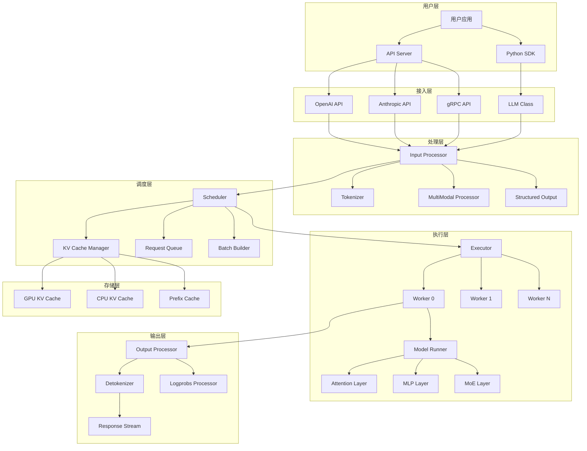

### 3.2 进程架构

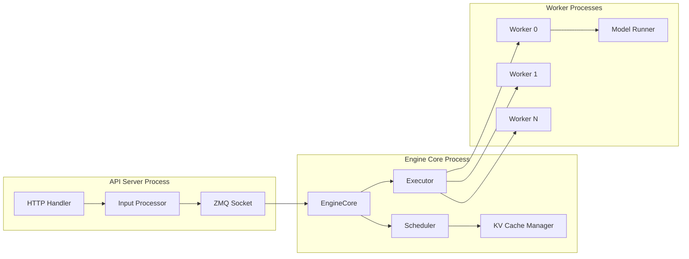

### 3.3 核心组件关系

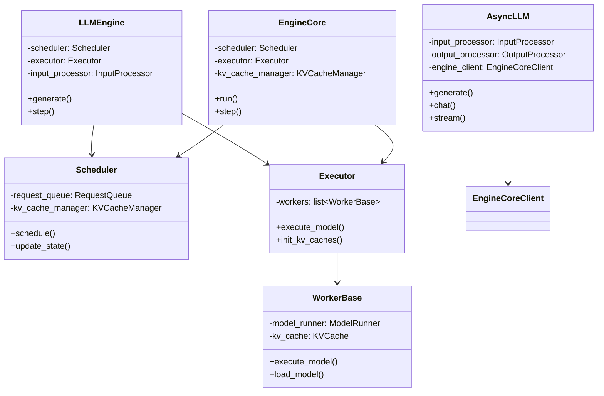

---

## 4. 用例设计

### 4.1 用例图

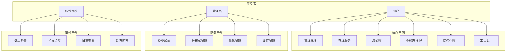

### 4.2 用例详情

#### 4.2.1 离线推理 (UC1)

| 字段 | 描述 |
|------|------|
| **用例名** | 离线推理 |
| **参与者** | 用户 |
| **前置条件** | 模型已加载，GPU 可用 |
| **主流程** | 1. 创建 LLM 实例 2. 调用 generate() 3. 获取输出 |
| **后置条件** | 生成文本结果 |
| **异常流程** | GPU 内存不足、模型不存在 |

**示例代码**：

```python
from vllm import LLM, SamplingParams

llm = LLM(model="meta-llama/Llama-3.2-1B")
params = SamplingParams(temperature=0.8, max_tokens=100)
outputs = llm.generate(["Hello, world!"], params)
```

#### 4.2.2 在线服务 (UC2)

| 字段 | 描述 |
|------|------|
| **用例名** | 在线服务 |
| **参与者** | 用户 |
| **前置条件** | 服务已启动 |
| **主流程** | 1. 发送 HTTP 请求 2. 接收响应 |
| **后置条件** | 返回生成结果 |
| **异常流程** | 服务不可用、超时 |

**启动命令**：

```bash
vllm serve meta-llama/Llama-3.2-1B \
    --host 0.0.0.0 \
    --port 8000 \
    --tensor-parallel-size 2
```

#### 4.2.3 流式输出 (UC3)

| 字段 | 描述 |
|------|------|
| **用例名** | 流式输出 |
| **参与者** | 用户 |
| **前置条件** | 服务已启动 |
| **主流程** | 1. 发送流式请求 2. 接收 SSE 事件 3. 实时处理 token |
| **后置条件** | 实时输出生成内容 |

**API 调用**：

```python
import openai

client = openai.OpenAI(base_url="http://localhost:8000/v1")
stream = client.chat.completions.create(
    model="meta-llama/Llama-3.2-1B",
    messages=[{"role": "user", "content": "Hello"}],
    stream=True
)
for chunk in stream:
    print(chunk.choices[0].delta.content, end="")
```

---

## 5. 类图设计

### 5.1 核心类层次结构

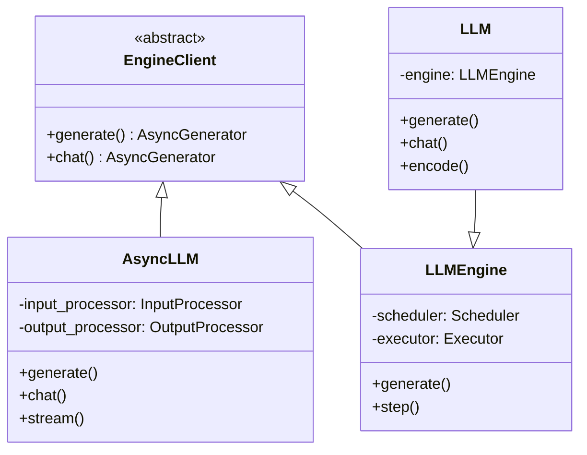

### 5.2 调度器类结构

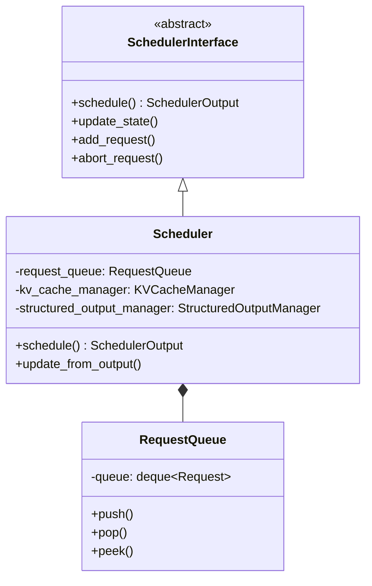

### 5.3 Worker 类结构

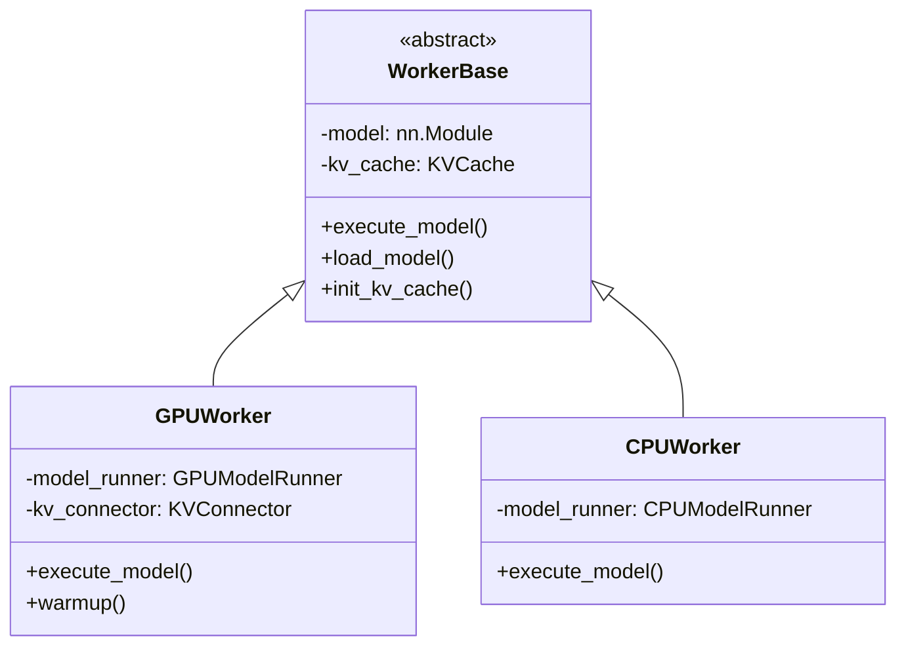

### 5.4 Executor 类结构

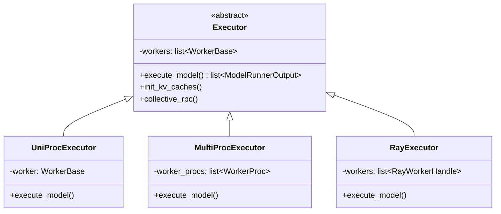

### 5.5 KV Cache 类结构

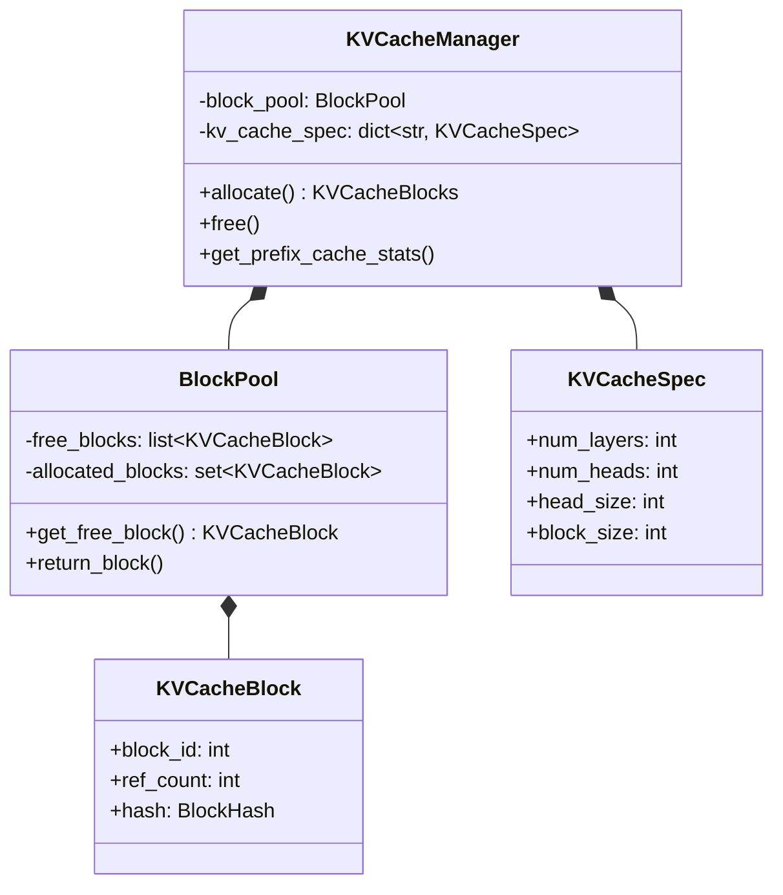

---

## 6. 时序图设计

### 6.1 请求处理完整流程

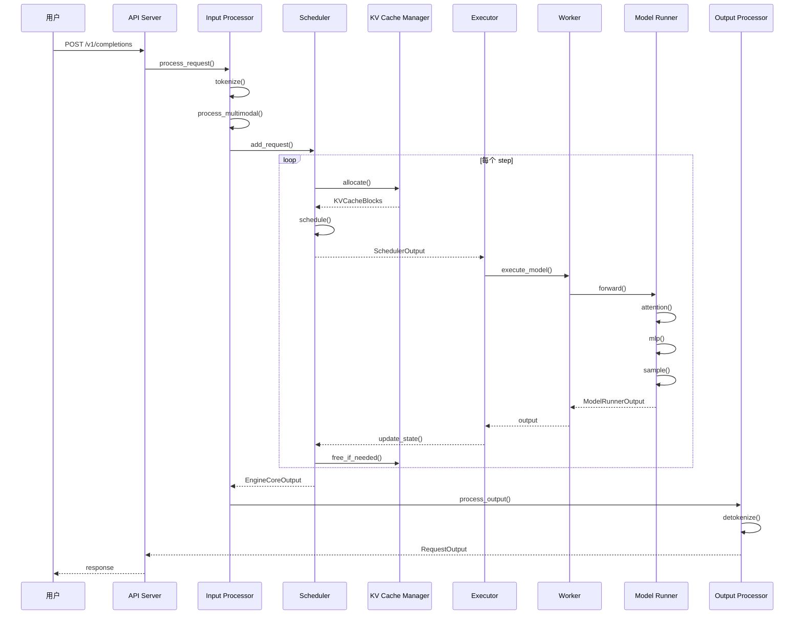

### 6.2 调度流程

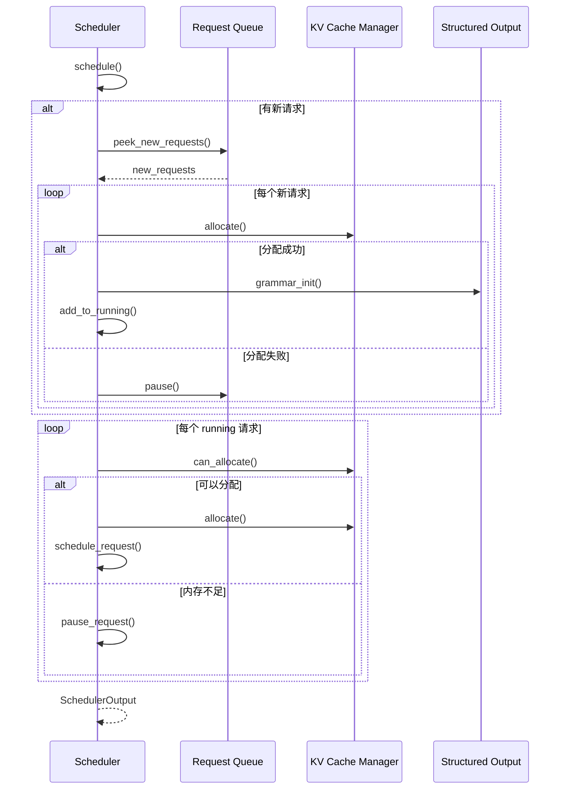

### 6.3 KV Cache 分配流程

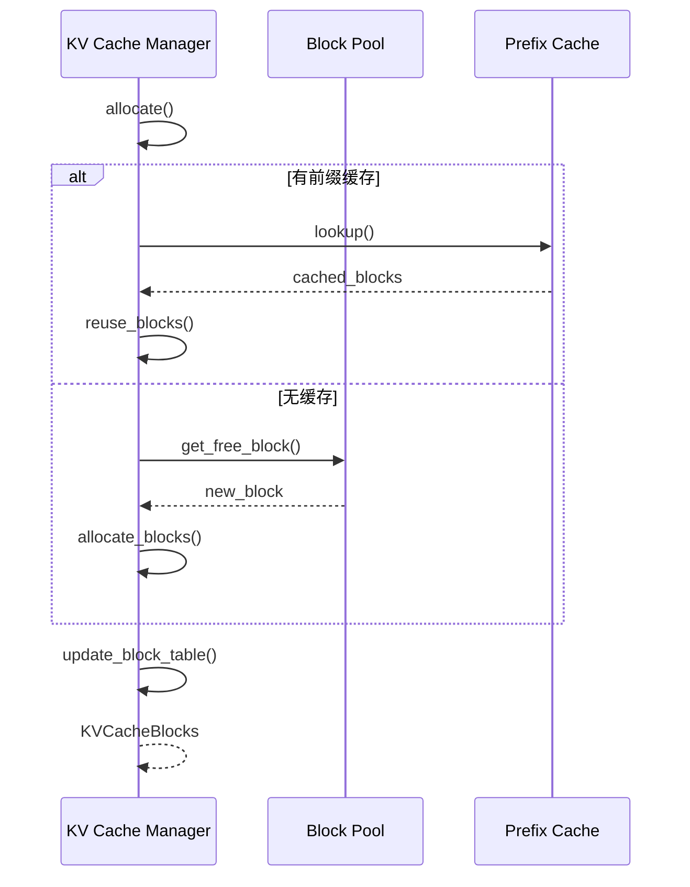

### 6.4 分布式推理流程

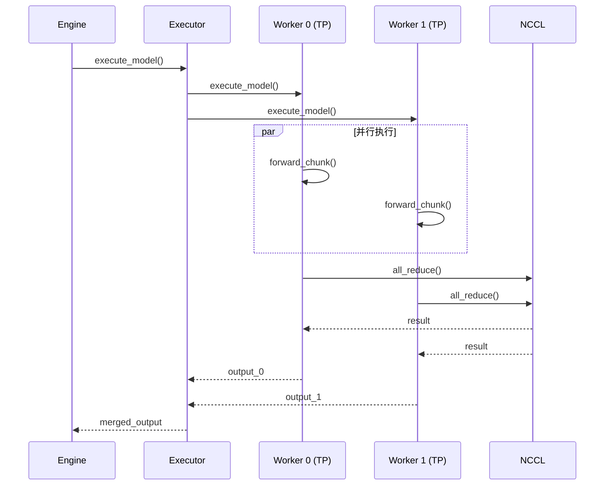

### 6.5 PD 分离流程

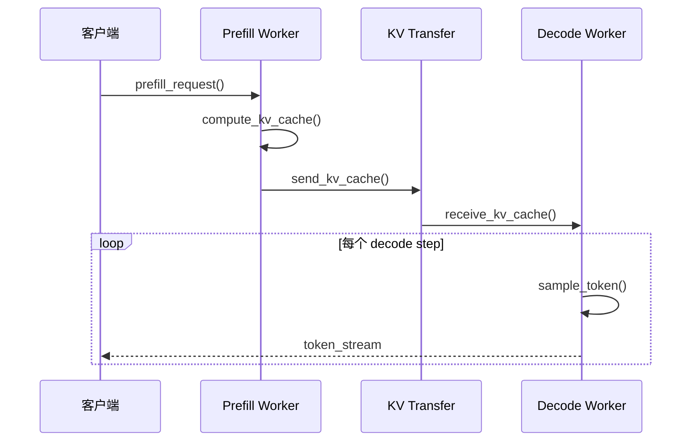

---

## 7. 活动图设计

### 7.1 请求处理活动图

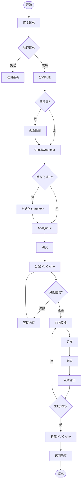

### 7.2 调度决策活动图

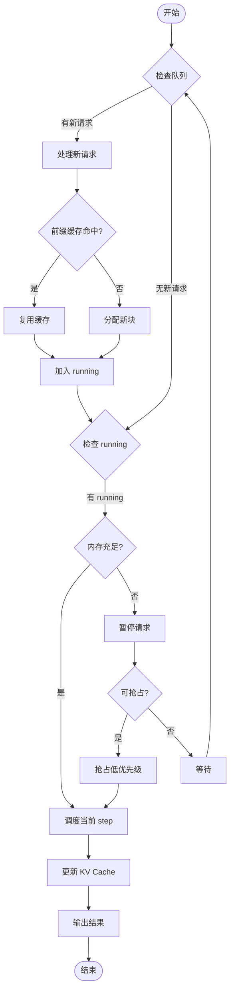

### 7.3 KV Cache 管理活动图

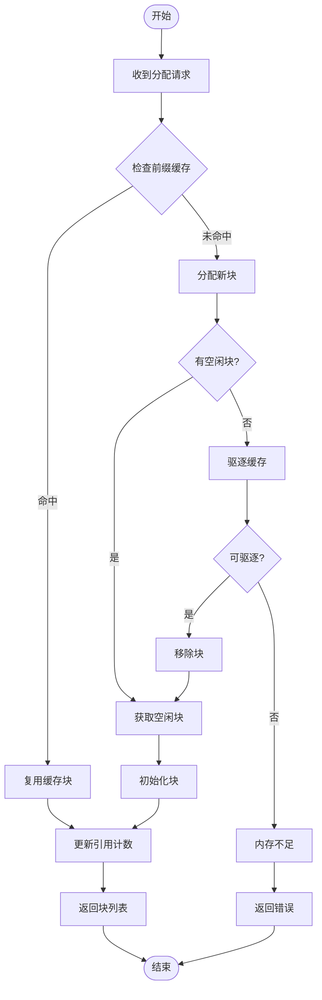

### 7.4 分布式推理活动图

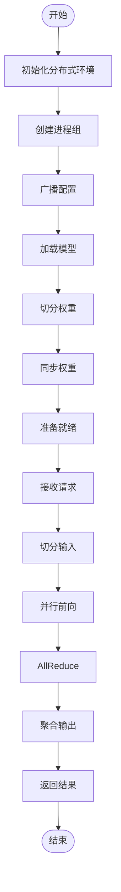

---

## 8. 模块设计

### 8.1 模块依赖图

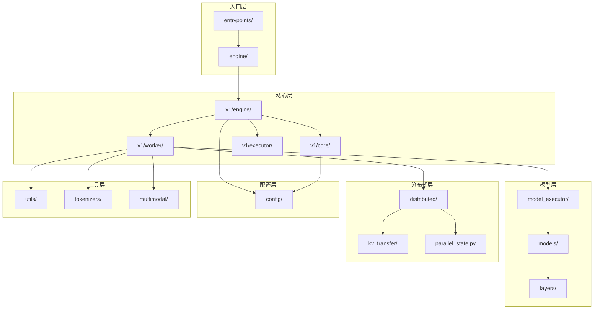

### 8.2 核心模块职责

| 模块 | 路径 | 职责 |
|------|------|------|
| **入口层** | `entrypoints/` | HTTP API、Python SDK |
| **引擎层** | `v1/engine/` | 请求处理、流式输出 |
| **调度层** | `v1/core/sched/` | 请求调度、batch 构建 |
| **KV 缓存** | `v1/core/kv_cache*` | 内存管理、前缀缓存 |
| **执行层** | `v1/worker/` | 模型执行、GPU 管理 |
| **并行层** | `v1/executor/` | 分布式协调 |
| **模型层** | `model_executor/` | 模型加载、层实现 |
| **分布式层** | `distributed/` | 通信、并行状态 |
| **配置层** | `config/` | 配置管理 |
| **多模态** | `multimodal/` | 图像/音频/视频处理 |

### 8.3 模块接口定义

#### 8.3.1 Scheduler 接口

```python
class SchedulerInterface(ABC):
    @abstractmethod
    def schedule(self, throttle_prefills: bool = False) -> SchedulerOutput:
        """调度请求到当前 step"""
        pass
    
    @abstractmethod
    def update_from_output(
        self,
        request_ids: list[str],
        outputs: ModelRunnerOutput,
    ) -> None:
        """根据输出更新状态"""
        pass
    
    @abstractmethod
    def add_request(self, request: Request) -> None:
        """添加新请求到队列"""
        pass
    
    @abstractmethod
    def abort_request(self, request_id: str) -> None:
        """中止请求"""
        pass
```

#### 8.3.2 Worker 接口

```python
class WorkerBase(ABC):
    @abstractmethod
    def execute_model(
        self,
        scheduler_output: SchedulerOutput,
    ) -> ModelRunnerOutput:
        """执行模型前向"""
        pass
    
    @abstractmethod
    def load_model(self) -> None:
        """加载模型"""
        pass
    
    @abstractmethod
    def init_kv_cache(
        self,
        kv_cache_config: KVCacheConfig,
    ) -> None:
        """初始化 KV cache"""
        pass
```

#### 8.3.3 Executor 接口

```python
class Executor(ABC):
    @abstractmethod
    def execute_model(
        self,
        scheduler_output: SchedulerOutput,
    ) -> list[ModelRunnerOutput]:
        """在所有 worker 上执行模型"""
        pass
    
    @abstractmethod
    def init_kv_caches(
        self,
        kv_cache_config: KVCacheConfig,
    ) -> None:
        """初始化所有 worker 的 KV cache"""
        pass
    
    @abstractmethod
    def collective_rpc(
        self,
        method: str,
        *args,
        **kwargs,
    ) -> list[Any]:
        """集体 RPC 调用"""
        pass
```

---

## 9. 接口设计

### 9.1 API 接口

#### 9.1.1 OpenAI 兼容 API

| 端点 | 方法 | 描述 |
|------|------|------|
| `/v1/completions` | POST | 文本补全 |
| `/v1/chat/completions` | POST | 聊天补全 |
| `/v1/models` | GET | 模型列表 |
| `/v1/models/{model}` | GET | 模型详情 |
| `/v1/embeddings` | POST | 向量嵌入 |

#### 9.1.2 请求格式

**Chat Completion Request**：

```json
{
    "model": "meta-llama/Llama-3.2-1B",
    "messages": [
        {"role": "system", "content": "You are helpful."},
        {"role": "user", "content": "Hello!"}
    ],
    "temperature": 0.7,
    "max_tokens": 100,
    "stream": true,
    "tools": [...]
}
```

**Response Format**：

```json
{
    "id": "cmpl-xxx",
    "object": "chat.completion",
    "created": 1234567890,
    "model": "meta-llama/Llama-3.2-1B",
    "choices": [{
        "index": 0,
        "message": {"role": "assistant", "content": "Hi!"},
        "finish_reason": "stop"
    }],
    "usage": {
        "prompt_tokens": 10,
        "completion_tokens": 5,
        "total_tokens": 15
    }
}
```

### 9.2 Python SDK 接口

#### 9.2.1 LLM 类

```python
class LLM:
    def __init__(
        self,
        model: str,
        tensor_parallel_size: int = 1,
        pipeline_parallel_size: int = 1,
        dtype: str = "auto",
        quantization: str | None = None,
        **kwargs,
    ):
        """初始化 LLM 引擎"""
        pass
    
    def generate(
        self,
        prompts: list[str] | list[dict],
        sampling_params: SamplingParams | None = None,
        use_tqdm: bool = True,
    ) -> list[RequestOutput]:
        """批量生成"""
        pass
    
    def chat(
        self,
        messages: list[dict],
        sampling_params: SamplingParams | None = None,
        chat_template: str | None = None,
    ) -> list[RequestOutput]:
        """聊天接口"""
        pass
    
    def encode(
        self,
        prompts: list[str],
        pooling_params: PoolingParams | None = None,
    ) -> list[PoolingRequestOutput]:
        """编码/嵌入"""
        pass
```

#### 9.2.2 SamplingParams 类

```python
@dataclass
class SamplingParams:
    n: int = 1
    temperature: float = 1.0
    top_p: float = 1.0
    top_k: int = -1
    max_tokens: int = 16
    stop: list[str] | None = None
    stop_token_ids: list[int] | None = None
    frequency_penalty: float = 0.0
    presence_penalty: float = 0.0
    logprobs: int | None = None
    prompt_logprobs: int | None = None
    output_kind: RequestOutputKind = "LAST"
```

### 9.3 内部接口

#### 9.3.1 SchedulerOutput

```python
@dataclass
class SchedulerOutput:
    # 新请求数据
    new_reqs: list[NewRequestData]
    # 继续的请求数据
    cached_reqs: list[CachedRequestData]
    # 需要抢占的请求
    preempted_reqs: list[str]
    # 前缀缓存统计
    prefix_cache_stats: PrefixCacheStats
    # KV connector 元数据
    kv_connector_metadata: KVConnectorMetadata | None
```

#### 9.3.2 ModelRunnerOutput

```python
@dataclass
class ModelRunnerOutput:
    # 生成的 token ids
    sampled_token_ids: list[list[int]]
    # logprobs
    logprobs: LogprobsLists | None
    # 采样 mask
    sampling_mask: SamplingMaskLists | None
    # KV connector 输出
    kv_connector_output: KVConnectorOutput | None
    # 性能统计
    perf_stats: PerfStats | None
```

---

## 10. 数据流设计

### 10.1 请求数据流

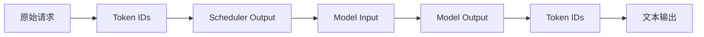

### 10.2 KV Cache 数据流

```mermaid
graph LR
    A[Prompt Tokens] --> B[Prefill 计算]
    B --> C[KV Cache 写入]
    C --> D[GPU Memory]
    D --> E[Decode 计算]
    E --> F[新 Token]
    F --> G[KV Cache 更新]
    G --> D
```

### 10.3 分布式数据流

```mermaid
graph TB
    A[全局输入] --> B[TP 切分]
    B --> C[Worker 0]
    B --> D[Worker 1]
    
    C --> E[本地计算]
    D --> F[本地计算]
    
    E --> G[AllReduce]
    F --> G
    
    G --> H[聚合输出]
```

### 10.4 PD 分离数据流

```mermaid
graph LR
    A[Prompt] --> B[Prefill Worker]
    B --> C[KV Cache]
    C --> D[KV Transfer]
    D --> E[Decode Worker]
    E --> F[Token Stream]
```

---

## 11. 部署架构

### 11.1 单机部署

```mermaid
graph TB
    subgraph "单机部署"
        A[Client] --> B[vLLM Server]
        B --> C[GPU 0]
        B --> D[GPU 1]
        C --> E[Model]
        D --> E
    end
```

**启动命令**：

```bash
vllm serve meta-llama/Llama-3.2-70B \
    --tensor-parallel-size 4 \
    --host 0.0.0.0 \
    --port 8000
```

### 11.2 多机部署

```mermaid
graph TB
    subgraph "Node 0"
        A[API Server] --> B[Engine Core]
        B --> C[Worker 0]
        B --> D[Worker 1]
    end
    
    subgraph "Node 1"
        E[Worker 2]
        F[Worker 3]
    end
    
    C <-->|NCCL| E
    D <-->|NCCL| F
    
    A --> G[Load Balancer]
```

### 11.3 K8s 部署

```yaml
apiVersion: apps/v1
kind: Deployment
metadata:
  name: vllm-server
spec:
  replicas: 2
  selector:
    matchLabels:
      app: vllm
  template:
    metadata:
      labels:
        app: vllm
    spec:
      containers:
      - name: vllm
        image: vllm/vllm-openai:latest
        args:
        - "--model=meta-llama/Llama-3.2-70B"
        - "--tensor-parallel-size=4"
        - "--host=0.0.0.0"
        - "--port=8000"
        resources:
          limits:
            nvidia.com/gpu: 4
        ports:
        - containerPort: 8000
```

---

## 12. 配置管理

### 12.1 配置层次

```mermaid
graph TB
    A[默认配置] --> B[配置文件]
    B --> C[环境变量]
    C --> D[命令行参数]
    D --> E[运行时配置]
```

### 12.2 核心配置类

```python
@dataclass
class VllmConfig:
    model_config: ModelConfig
    cache_config: CacheConfig
    parallel_config: ParallelConfig
    scheduler_config: SchedulerConfig
    device_config: DeviceConfig
    load_config: LoadConfig
    lora_config: LoRAConfig | None
    speculative_config: SpeculativeConfig | None
    quantization_config: QuantizationConfig | None
    kv_transfer_config: KVTransferConfig | None
    structured_outputs_config: StructuredOutputsConfig | None
    observability_config: ObservabilityConfig | None
```

### 12.3 关键配置项

| 配置项 | 类型 | 默认值 | 描述 |
|--------|------|--------|------|
| `model` | str | 必填 | 模型名称或路径 |
| `tensor_parallel_size` | int | 1 | TP 并行度 |
| `pipeline_parallel_size` | int | 1 | PP 并行度 |
| `max_model_len` | int | 自动 | 最大序列长度 |
| `gpu_memory_utilization` | float | 0.9 | GPU 内存利用率 |
| `dtype` | str | "auto" | 数据类型 |
| `quantization` | str | None | 量化方法 |
| `enable_prefix_caching` | bool | True | 前缀缓存 |
| `enable_chunked_prefill` | bool | True | 分块预填充 |
| `max_num_batched_tokens` | int | 自动 | 最大 batch token 数 |
| `max_num_seqs` | int | 自动 | 最大 batch 大小 |

---

## 13. 错误处理

### 13.1 错误分类

| 类型 | 描述 | 处理方式 |
|------|------|----------|
| **验证错误** | 输入参数错误 | 返回 400 |
| **资源错误** | GPU 内存不足 | 重试或拒绝 |
| **模型错误** | 模型加载失败 | 返回 500 |
| **分布式错误** | 通信失败 | 故障转移 |
| **超时错误** | 请求超时 | 返回 408 |

### 13.2 错误处理流程

```mermaid
graph TD
    A[错误发生] --> B{错误类型}
    
    B -->|验证错误| C[返回 400]
    B -->|资源错误| D{可重试?}
    B -->|模型错误| E[返回 500]
    B -->|分布式错误| F[故障转移]
    B -->|超时错误| G[返回 408]
    
    D -->|是| H[等待重试]
    D -->|否| I[返回 503]
    
    H --> J{重试次数?}
    J -->|< 3| A
    J -->|>= 3| I
```

### 13.3 故障恢复

```python
class FaultTolerance:
    def handle_worker_failure(self, worker_id: int) -> None:
        """处理 worker 故障"""
        # 1. 检测故障
        # 2. 重启 worker
        # 3. 恢复状态
        # 4. 重新分配请求
        pass
    
    def handle_oom(self, worker_id: int) -> None:
        """处理 OOM"""
        # 1. 驱逐低优先级请求
        # 2. 释放 KV cache
        # 3. 重试当前请求
        pass
```

---

## 14. 性能优化

### 14.1 优化技术

| 技术 | 描述 | 效果 |
|------|------|------|
| **PagedAttention** | KV cache 分页 | 内存利用率 2-4x |
| **连续批处理** | 动态 batch | 吞吐量 2-10x |
| **前缀缓存** | KV cache 复用 | TTFT 降低 50% |
| **CUDA Graphs** | 内核融合 | 延迟降低 30% |
| **Tensor 并行** | 模型切分 | 吞吐量线性扩展 |
| **推测解码** | 并行生成 | 延迟降低 2-3x |

### 14.2 性能指标

| 指标 | 描述 | 目标值 |
|------|------|--------|
| **TTFT** | Time to First Token | < 100ms |
| **ITL** | Inter-Token Latency | < 50ms |
| **Throughput** | tokens/s | > 1000 (A100) |
| **GPU Utilization** | GPU 利用率 | > 90% |
| **Memory Efficiency** | 内存效率 | > 80% |

### 14.3 优化策略

```mermaid
graph TD
    A[性能瓶颈] --> B{瓶颈类型}
    
    B -->|计算瓶颈| C[增加 GPU]
    B -->|内存瓶颈| D[优化 KV Cache]
    B -->|通信瓶颈| E[优化 NCCL]
    B -->|调度瓶颈| F[优化 Scheduler]
    
    C --> G[TP/PP 扩展]
    D --> H[PagedAttention]
    E --> I[梯度压缩]
    F --> J[连续批处理]
```

---

## 15. 测试策略

### 15.1 测试层次

| 层次 | 描述 | 覆盖率目标 |
|------|------|-----------|
| **单元测试** | 函数/类测试 | > 80% |
| **集成测试** | 模块间交互 | > 70% |
| **系统测试** | 端到端测试 | > 60% |
| **性能测试** | 压力/负载测试 | - |

### 15.2 测试类型

| 类型 | 工具 | 描述 |
|------|------|------|
| **单元测试** | pytest | 函数级测试 |
| **集成测试** | pytest | 模块间测试 |
| **基准测试** | benchmarks/ | 性能基准 |
| **正确性测试** | tests/ | 模型输出正确性 |
| **分布式测试** | tests/distributed/ | 多 GPU 测试 |

### 15.3 测试用例示例

```python
# 单元测试
def test_kv_cache_allocation():
    manager = KVCacheManager(config)
    blocks = manager.allocate(num_tokens=100)
    assert len(blocks) > 0
    manager.free(blocks)

# 集成测试
def test_generation_pipeline():
    llm = LLM(model="test-model")
    outputs = llm.generate(["Hello"])
    assert len(outputs) > 0

# 性能测试
def test_throughput():
    llm = LLM(model="test-model")
    start = time.time()
    for _ in range(100):
        llm.generate(["Hello"])
    elapsed = time.time() - start
    assert elapsed < 10  # 100 requests in 10 seconds
```

---

## 16. 附录

### 16.1 术语表

| 术语 | 描述 |
|------|------|
| **TTFT** | Time to First Token，首 token 延迟 |
| **ITL** | Inter-Token Latency，token 间延迟 |
| **TP** | Tensor Parallelism，张量并行 |
| **PP** | Pipeline Parallelism，流水线并行 |
| **DP** | Data Parallelism，数据并行 |
| **EP** | Expert Parallelism，专家并行 |
| **KV Cache** | Key-Value Cache，键值缓存 |
| **MoE** | Mixture of Experts，混合专家 |
| **PD** | Prefill-Decode，预填充-解码 |

### 16.2 参考文献

- vLLM 官方文档: https://docs.vllm.ai
- PagedAttention 论文: https://arxiv.org/abs/2309.06180
- vLLM GitHub: https://github.com/vllm-project/vllm

### 16.3 相关文件

| 文件 | 描述 |
|------|------|
| `notes/08-pd-separation.md` | PD 分离详细文档 |
| `notes/05-distributed-inference.md` | 分布式推理学习笔记 |
| `notes/06-ascend-cann.md` | Ascend 适配路线图 |

---

*最后更新: 2026-08-12*
