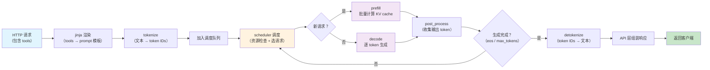

# Phase 0: vLLM 请求处理流程

## 各环节对应代码

| 环节 | 文件 |
|---|---|
| API 入口 | `vllm/entrypoints/openai/api_server.py` |
| 引擎主循环 | `vllm/v1/engine/core.py` |
| 调度器 | `vllm/v1/core/sched/scheduler.py` |
| 模型执行 | `vllm/v1/worker/gpu/model_runner.py` |
